Prénom: Abdoul Gadirou

Nom: DIALLO

Promotion: BootCamp DevOps 17

# Mini-Projet Jenkins

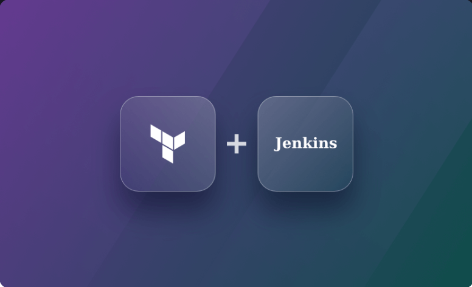

# Application :static-website-Example

**static-website-Example** est un site web static 
# Prérequis
  Avoir Jenkins d'installé sur une machine ou un conteneur docker.
  Dans le cadre de ce projet le serveur Jenkins est un conteneur docker qui s'exécute sur une instance ec2 dans AWS.

  

# Objectif du mini projet

- Faire un fichier Dockerfile à partir duquel on va builder l'image qui permettra de déployer l'application
- Utiliser Terraform pour provisionner l'infrastructure sur 
  laquelle l'application sera déployée
- Faire un pipeline CI/CD permettant de :
   - Builder l'image qui permettra de déployer l'application
   - Tester l'image
   - Pousser l'image dans le registre de conteneurs Dockerhub
   - Déployer l'application sur :
        - l'environnement de *staging* à chaque commit pour tester la non régression de l'application
        - l'environnement de *review* à chaque *merge request* 
        - l'environnement de production une fois qu'on merge sur la branche *master*
 
**Livrable**

- Dockerfile
- Modules terraform (dossier modules,prod,review et staging)
- Fichier _Jenkinsfile_
- Fichier _LISEZ-MOI.md_ ou _README.md_

# Installation des plugins jenkins et configuration

- HTTP request

   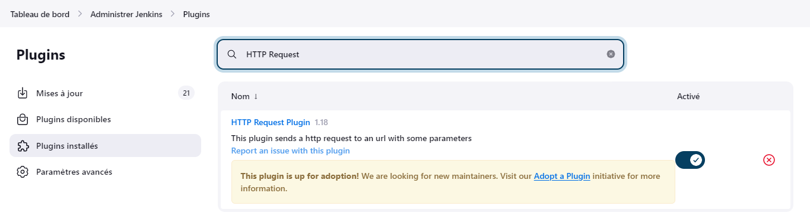

- docker-build-step

  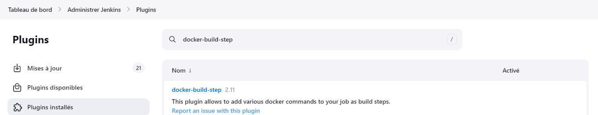

  - Configuration 
    - Aller sur _Manage jenkins_ → _Configure system_ → _Docker Builder_ → renseigner la socket unix 
      (unix:///var/run/docker.sock)
    - Tester la connectivité

- Terraform plugin

   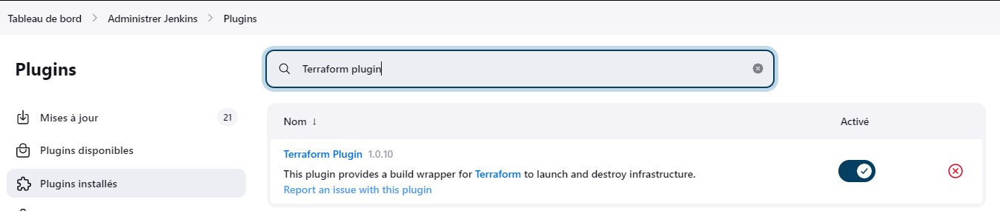

  - Configuration
    - Télécharger le binaire Terraform sur le conteneur Jenkins

     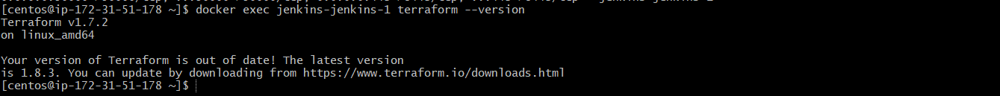
     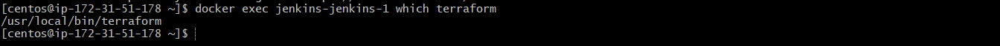

    - Aller sur _Manage jenkins_ → _Global Tool configuration → _Terraform_ → _Add terraform_
    - Renseigner le chemin du binaire terraform sur le conteneur Jenkins

     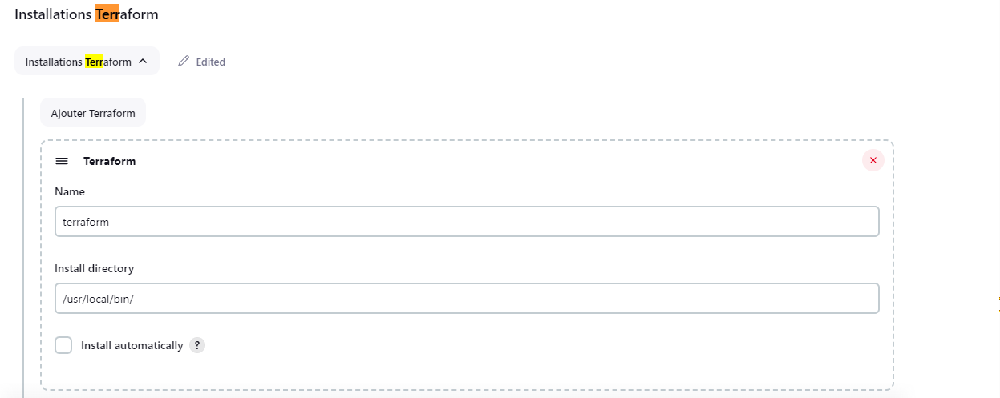

- Ansible
  - Installer Ansible sur le conteneur Jenkins 

    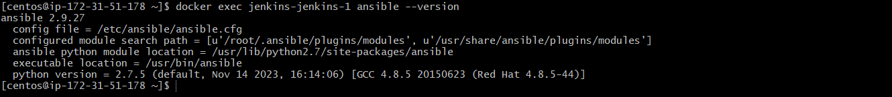

- Configuration du Webhook
  - Aller sur le _mini-projet-jenkins_ dans github  → Settings  → Webhooks → Ajouter un webhooks en renseignant l'url de la machine Jenkins 

  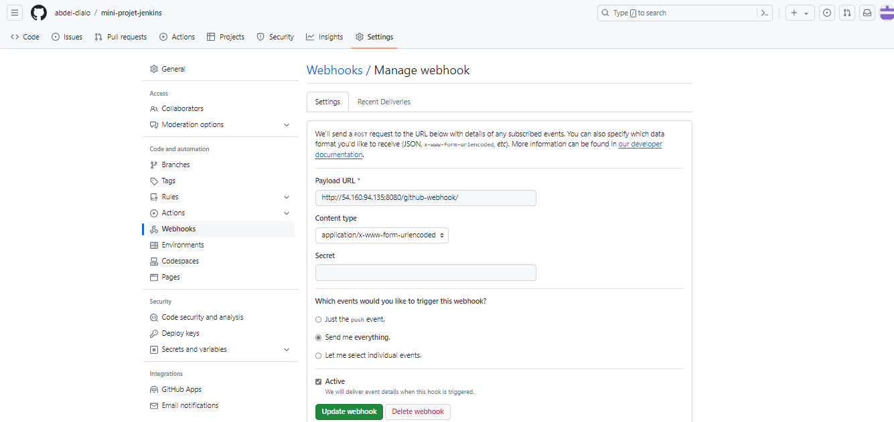

  - Aller sur le job du _mini-projet-jenkins_ dans jenkins  → Configure  → Build Triggers
  → GitHub hook trigger for GITScm polling

  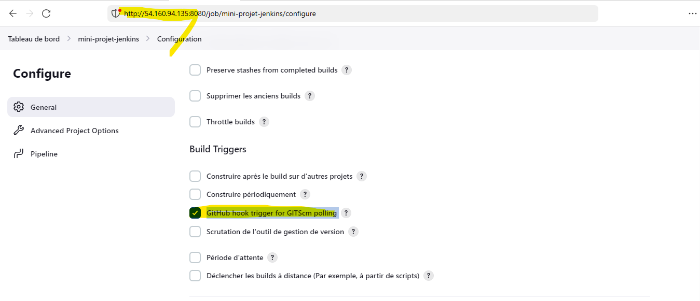

 

# Infrastructure 
   
   Pour provisionner les trois environnements j'ai utilisé trois modules racines (review,staging,prod) qui font appel au module _ec2module_.

  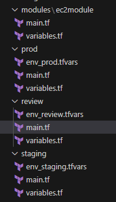

   *1*-Module ec2module

  - Contenu du module:

    _Datasource_  _aws_ami: 
      Permet de récupérer dynamiquement la dernière version de l'AMI Ubuntu bionic 
  - Instance ec2:
     - Provisionneur _remote-exec_ pour installer _docker_ sur la 
         machine qui sera provisionnée dans le but de pouvoir builder l’image _docker_ qui embarque l'application _static-website-example_ 

  - Variables déclarées et qui pourront être surchargées
    - *instancetype*: type de l'instance ec2
     - *env_tag* : tag de l'instance qui sera en fonction de l'environnement à provisionner 
    - *ssh_key_file* : variable qui contiendra le chemin de la paire de clé de l'ec2 et cette paire de clé sera un _secret file_ dans jenkins. 
    - *sg_name*: nom du groupe de sécurité qui sera lié à l'instance ec2
    
*5*-Module racine (review,staging,prod):

  Les trois modules racines font appel au module _ec2module_ pour provisionné les environnements **review** ,**staging** et **prod**.
    Pour rendre le déploiement dynamique j’ai créé un fichier _.tfvars_ pour surcharger les variables *env_tag*,*instancetype* et *sg_name* dans chaque module racine.
    les fichiers _env_review.tfstate_,_env_staging.tfstate_,_env_prod.tfstate_  contient respectivement l'état des infrastructures **review**,**staging** et **prod**.
    Ces fichiers sont conservés dans un Backend distant S3.

  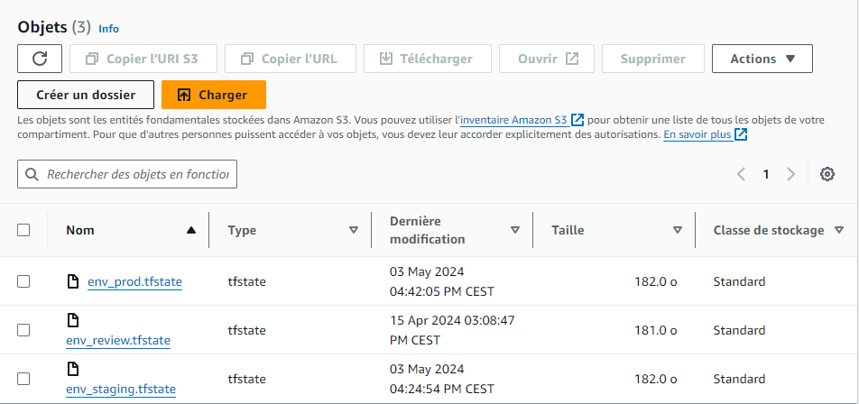

# Ecriture du Dockerfile
  
  Dans le fichier Dockerfile (voir Dockerfile):
  - On est parti d'une image _ubuntu_ sur lequel on installe Git et un serveur web en l'occurrence 
    _nginx_
  - On clone les sources de l'application pour avoir les dernièrs mises de l'application dans le conteneur après le déploiement 

# Création du pipeline CI/CD

   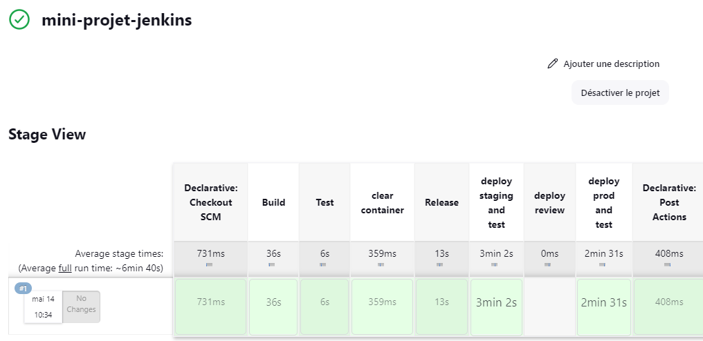

  Pour mettre en place le CI/CD j'ai créé un fichier _Jenkinsfile_ à la racine du projet.
  Le CI/CD sera constitué des étapes suivantes:
  - Environnement: qui contient les variables d'environnement suivant:

     **IMAGE_NAME**: nom de l'image docker qui pourra être surchargé lors du build

     **TAG_NAME**: tag de l'image docker qui pourra être surchargé lors du build

     **SERVER_USER**: utilisateur par défaut de l'instance ec2.

     **DOCKERHUB_ID**: _id_ du Dockerhub

     **DOCKERHUB_PASSWORD**: variable type _secret text_ qui contient le mot de passe du Dockerhub.

     **SSH_PRIVATE_KEY**:variable de type _secret file_  contenant la paire de clé de l'instance ec2.

  - Stages:
     - Build image
     - Test acceptation
     - Release image
     - Deploy review
     - Stop review
     - Deploy staging
     - validate
     - build
     - deploy  

## Build image

  Dans le job _Build_ on conteneurise l’application à partir du _Dockerfile_ 
   

## Test acceptation

   Dans le job _Test acceptation_ on teste l'image docker avant de le pousser dans le registre 
   
   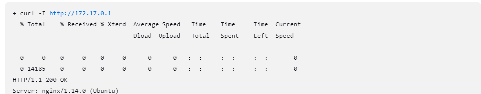

## Release image

  Une fois que le job de test d'acceptation est passe, dans le job _Release image_ on pousse l'image dans le registre Dockerhub

  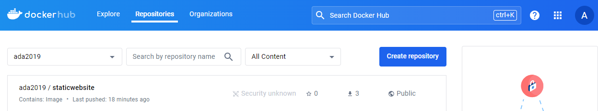 

## Deploy staging and test

  - Provisionnement de l'environnement **staging** à partir des modules terraform

    Ajout de 3 ressources: **aws_instance**, **aws_security_group** et **aws_eip** 

      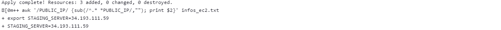
      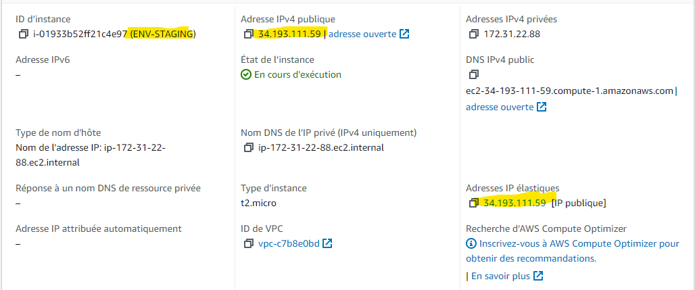
      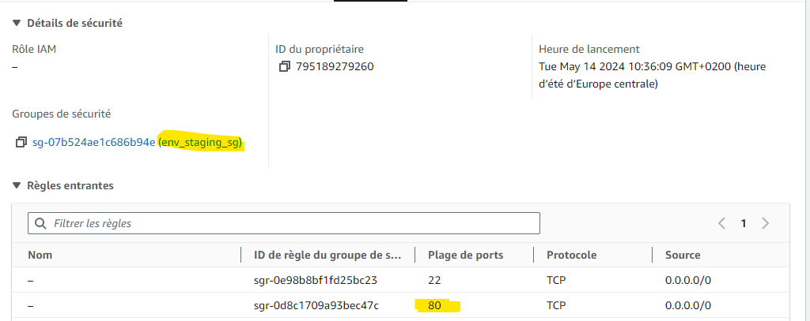

  - Déploiement de l'application **static-website-Example**

  - Test de l'application après le déploiement 

    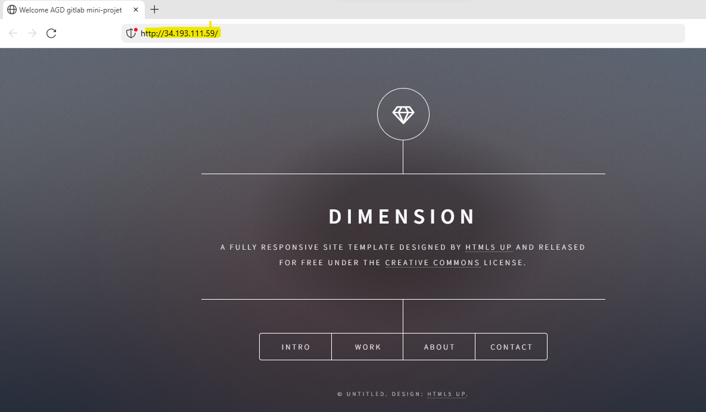

## Deploy review  

  Ce job n'est exécuté que lorsqu'on ouvre une _merge request_ ainsi l'application est déployée sur l'environnement de revue

## Deploy prod and test

  - Provisionnement de l'environnement **prod** à partir des modules terraform

    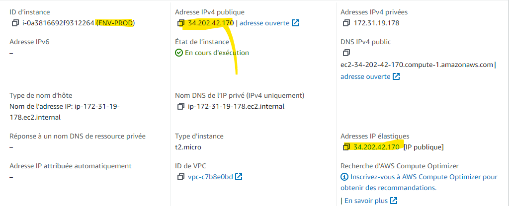
    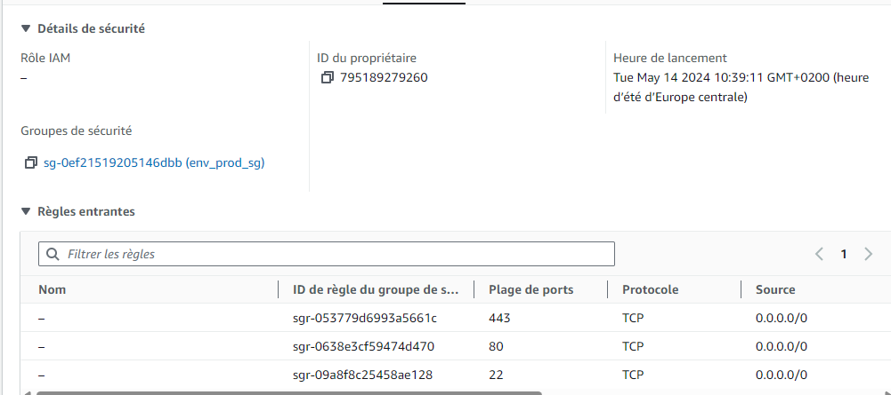

  - Déploiement de l'application **static-website-Example**

  - Test de l'application après le déploiement 

    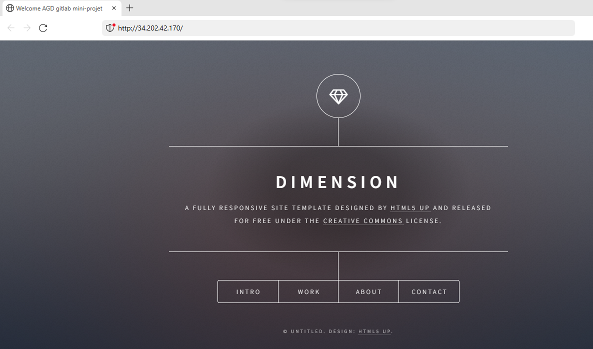
   

# Post 
  
  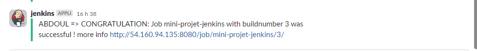

# Conclusion

 Ce projet m'a permit de mettre en pratique:
 - Le CI/CD sur Jenkins
 - l'IaC ( provisionnement d'infrastructure et déploiement d'application avez Terraform )
 - Le cloud AWS 
